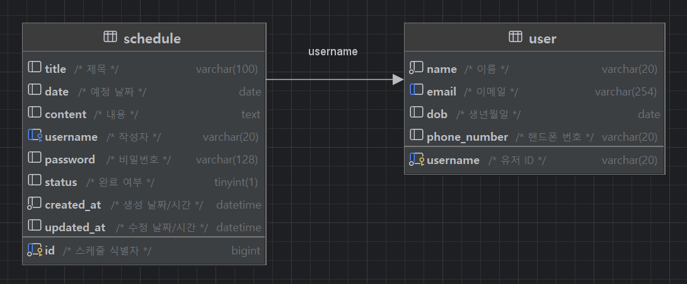

# 일정 관리 앱

<hr>

## 1. 프로젝트 개요
일정 및 유저 관련 CRUD를 실행하는 백엔드 API입니다.

(유저 관련 CRUD는 미구현 상태입니다.)

<hr>

## 2. 기술 스택
- Java 17
- MySQL 9.2
- Spring Boot 3.4.3
- Lombok
- JdbcTemplate
- Gradle

<hr>

## 3. ERD


<hr>

## 4. API 명세서

### 4.1. 일정 생성

- 메서드: `POST`
- URL: `/schedules`
- Request Body
  ```
  {
    "title": "제목1",
    "date": "2025-03-25",
    "content": "내용1",
    "username": "user1",
    "password": "1234",
    "status": true
  }
  ```
- Response
  ```
  {
    "id": 6,
    "title": "제목1",
    "date": "2025-03-25",
    "content": "내용1",
    "username": "user1",
    "status": true,
    "created_at": null,
    "updated_at": null
  }
  ```
  (`created_at`, `updated_at` 컬럼은 DB에서 생성되므로 Response에는 들어있지 않습니다.)
- Response Code: `201 Created`, `400 Bad Request`

### 4.2. 일정 리스트 조회

- 설명 
  - 현재 시점부터 선택한 수정일까지의 일정을 조회합니다. 
  - 수정일과 작성자를 기입하지 않을 경우 전체 일정을 조회합니다.
- 메서드: `GET`
- URL: `/schedules?updatedAt=2025-03-25&username=user1`
- Response
  ```
  [
    {
        "id": 6,
        "title": "제목1",
        "date": "2025-03-25",
        "content": "내용1",
        "username": "user1",
        "status": true,
        "created_at": "2025-03-26T03:36:17.000+00:00",
        "updated_at": "2025-03-26T03:36:17.000+00:00"
    },
    {
        "id": 5,
        "title": "제목4",
        "date": "2025-03-25",
        "content": "내용4",
        "username": "user1",
        "status": true,
        "created_at": "2025-03-25T06:49:09.000+00:00",
        "updated_at": "2025-03-25T06:49:09.000+00:00"
    },
    {
        "id": 4,
        "title": "제목4",
        "date": "2025-03-25",
        "content": "내용4",
        "username": "user1",
        "status": true,
        "created_at": "2025-03-25T06:31:05.000+00:00",
        "updated_at": "2025-03-25T06:31:05.000+00:00"
    }
  ]
  ```
- Response Code: `200 OK`, `400 Bad Request`